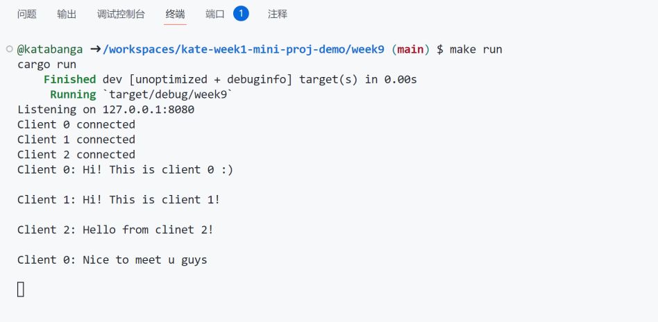

# Week9 Simple Chat Server
This is a basic chat server that allows multiple users to connect and send messages to each other using TCP.

## Example usage
* Start the server by `make run`. The server prints out a message when a client connects. Also, it prints out chat messages of all the clients.

* The first client joins by connecting to the server: `telnet 127.0.0.1 8080`. The client can send messages, which will be send to all other users connected to this server. Also, it receives messages from all other users.

* The second client joins by connecting to the server: `telnet 127.0.0.1 8080`.  

* The third client joins by connecting to the server: `telnet 127.0.0.1 8080`
